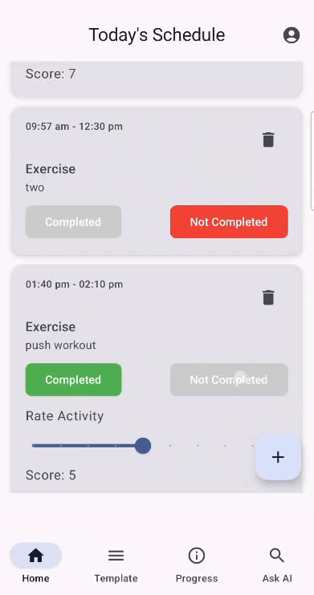
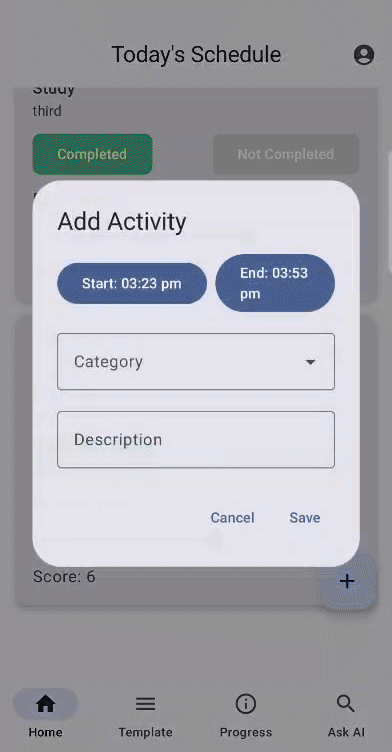
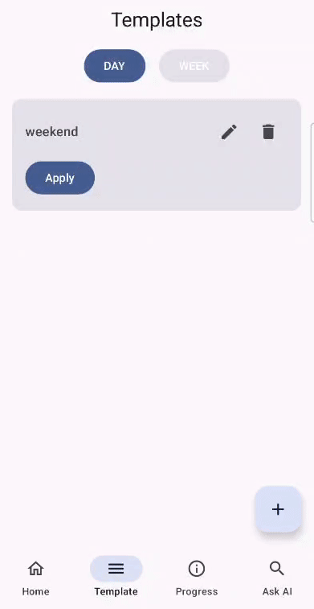
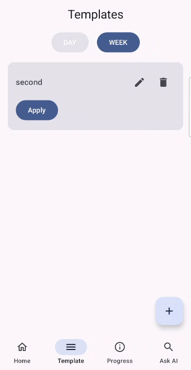
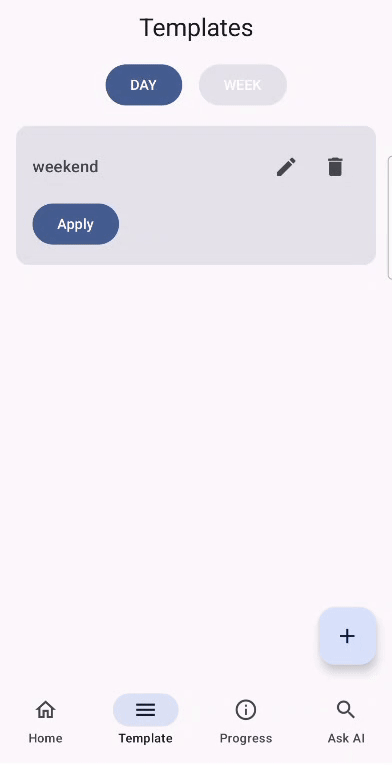

#  Tracker App

**Activity Tracker App** is a fully-featured Android application built using **Jetpack Compose** and **Firebase**. It allows users to track, visualize, and analyze their daily activity time and effort, with support for reusable templates and Gemini AI-powered insights.

---

##  Features

* ️ **Track Time and Effort**: Log activities and assign time and effort scores.
* ️ **Custom Templates**: Save and reuse Day/Week activity templates.
* ️ **Automatic Updates**: Background service adds daily progress entries and populates today's plan using WorkManager.
*  **Visual Insights**: View trends using interactive line, pie, and bar charts.
*  **Gemini AI Integration**: Ask the AI to analyze your performance.
*  **Firebase Auth**: Secure login with Google.
* ️ **Cloud Firestore**: Sync data across devices in real-time.

---

##  How it looks 

 |  |  |  |  | 


##  Tech Stack

* **Jetpack Compose** for UI
* **Kotlin Coroutines and Flows + ViewModel** for state
* **Android WorkManager** – Background jobs for daily automation
* **Firebase Auth, Firestore** for backend
* **Google Generative AI SDK** for Gemini chat integration
* **[tehras/charts](https://github.com/tehras/charts)** for beautiful Compose charts

---


##  License

```
Licensed under the Apache License, Version 2.0
Copyright 2025 Badri Narayan
```

This app uses:

* `tehras/charts` licensed under [Apache 2.0](https://github.com/tehras/charts/blob/master/LICENSE.txt)

---

##  Acknowledgements

* Jetpack Compose community
* Firebase & Google AI SDK teams
* [Tehras Charts](https://github.com/tehras/charts) for the charting library

---

##  Contact

For collaborations, or feedback:
**Badri Narayan**
 `badrinarayan4445@gmail.com`

---
